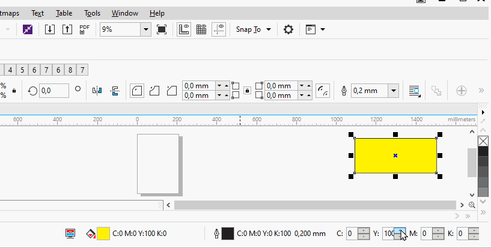

# CorelDraw exemple addon

This addon will create a control in **colorStyle status bar**, in this control is placed 4 wpf custom textbox for controller CYMK color of the active shape, i don't know if his location is the best for ur purposes.  
Remember this is not a final product.

|  |
| --- |
| 
  Mouse Wheel Works! 
 |

